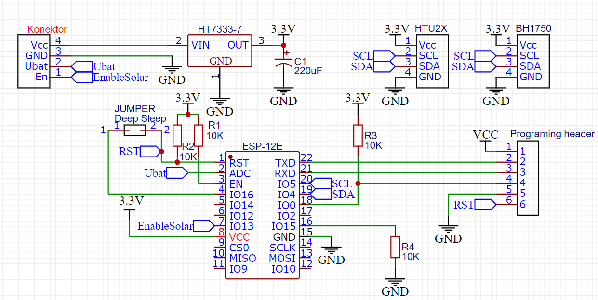
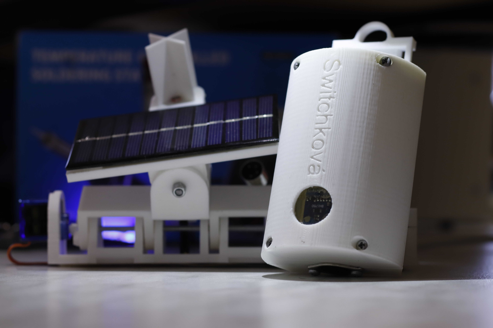
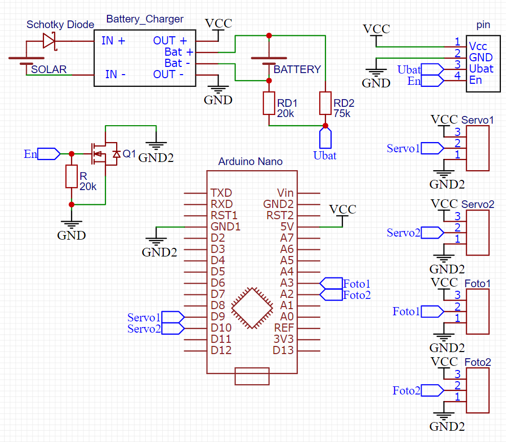
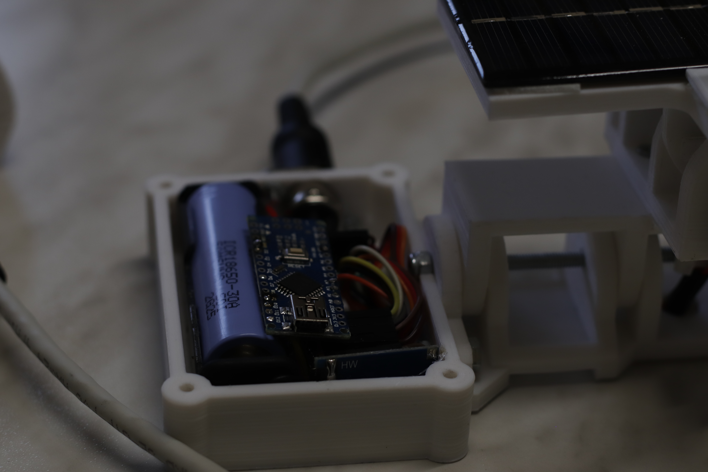
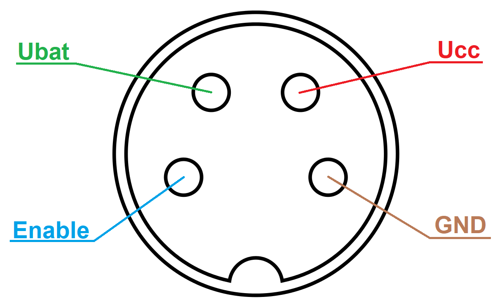
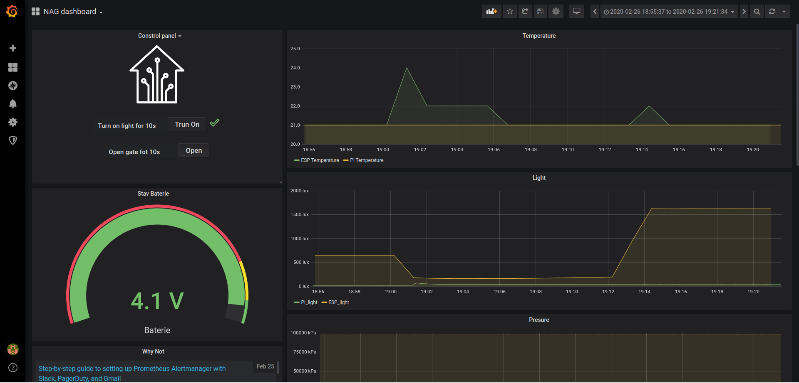
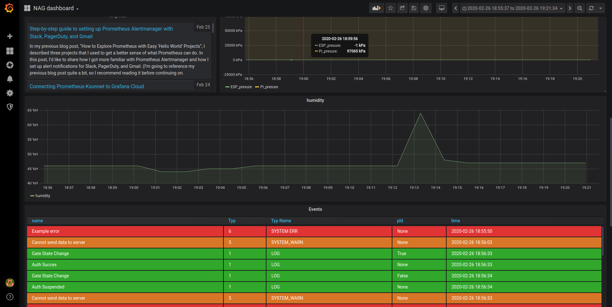
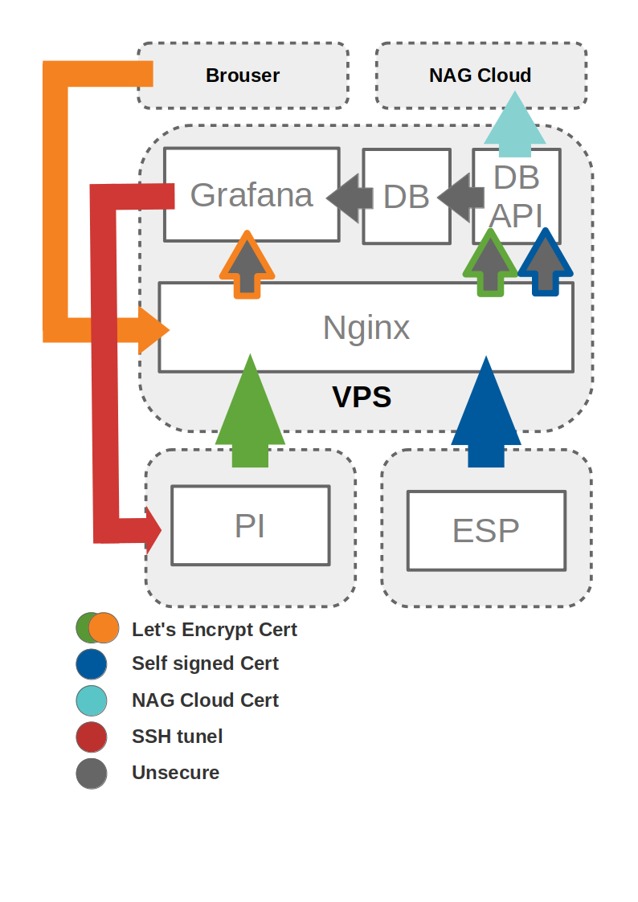

## ESP
### Power-Saving metody
    - použití holého čipu 
    - low drop napetový regulátor
    - kondenzátor 
    - deep sleep
### Čip

Místo celé desky esp8266 jsme použily jen její čip/modul esp-12F kvůli menším rozměrům a spotřebě. Zapojení viz. schéma níže

### DeepSleep

Vždy po vykonání programu(připojení se k wifi, odesílání dat, atd.) se esp uvede do deep sleepu na danou dobu. Pro deep sleep jsme museli propojit pin GPIO16 s resetem, kvůli programování jsme to museli udělat přes jumper. 

### Odesílání na server
Po probuzení se esp pokusí připojit k místní wifi (30 pokusů), pokud se mu to nepovede 1x zabliká a usne. Poté se pokusí navázat spojení se servrem a ověří si jestli podpis poslaného certifikátu odpovídá poslanému sertifikátu (po 30 pokusech 2x zabliká a usne). Pokud i toto proběhne bez problémů, pošle POST (PUT by dával asi lepší smysl ale už se nám taková drobnost nechtěla měnit) request na server s naměřenými hodnotami. Na odpově serveru nečeká a usímá. 

### Programování

Pro programování esp-12F jsme použili desku esp8266 dle následujícího zapojení:

### Senzory

Pro měření svítivosti je použito čidlo BH1750 a pro vlhkost a teplotu je použito HTU21

### Regulátor

Jako regulátor jsme použili HT7333-7, který je velmi efektivní. Pro lepší zvládání špičkových proudů jsme použili 220 uf kondenzátor.

### Krabička

Celý obvod je dán do tištěné krabičky kterou je požné zavěsit, připevnit popruhy nebo přišroubovat. Jsou v ní větrací průduchy aby šlo spolehlivě číst vlhkost a teplotu. Pro měření teploty je zde díra ve které je silikonem(kvůli vodotěsnosti) vlepen plátek průhlehného plastu.

Panel a Krabička

## Solární panel

 součástí solárního panelu je mechanismus na natáčení panelu za sluníčkem, baterie a nabíjecí obvod.

### Natáčení panelu

Pro natáčení panelu jsme použily kříž z fotorezistorů a servomotory, původně jsem se snažil upravit  zpětnou vazbu servomotorů tím že jsem nahradil potenciometry v servech fotorezistory zapojenými v úhlopříčce již zmíněného kříže jako děliče napětí (do serva se musí posílat signál 90 stupňů aby se snažilo mít odpory 1:1) tím pádem jsem dostal zpětnou vazbu nezávislou na poloze osy ale na poloze slunce na obloze. Tato strategie moc nevyšla kvůli pomalé reakci fotorezistorů kterým chvíli trvá změnit odpor se změnou osvětlení což způsobovalo nechtěné oscilace solárního panelu kdy se natočil o moc velký úhel a poté se vracel zpátky, snažil jsem se to vyřešit přidáním 51k ohm odporů to by zmenšilo změnu odporu vůči celkovému odporu a čím blíže je servo bodu vyvážení pohybuje se pomaleji což by zmenšilo oscilace, to bohužel také nevyšlo kvůli nepřesnosti odporů. Další pokus bylo použit attiny13 kvůli malé spotřebě a ideálnímu počtu pinů. Toto řešení také nebylo funkční, kvůli nedostatku časovacích registrů nutných pro řízení servo motorů a celkově nedostatku paměti, projekt zabíral dvakrát více paměti programu než je na čipu. Nakonec jsme tam dali upravené ardnuino Nano na kterém jsme rno menší spotřebu přemostily regulátor a odstranily LEDky indikující stav arduina protože v neprůhledné krabičce nejsou vidět. Napsali jsme na něho jednoduchý kód. Další věc na úsporu pro nás tak drahé energie je spínání arduina a servo motorů mosfetem ovládaným z ESP.
Mecchanická konstrukce je provedena pomocí 3D tištěných dílů z bílého PLA. Osy okolo kterých se solár otáčí jsou udělány z závitové tyče m4 seříznuté a zabroušené na míru, lehký pohyb zajišťují kuličková ložiska r4.

### Baterie a nabíjecí obvod

Jsou umístěny spolu s kontrolním obvodem natočení v 3D tištěné krabičce z bílého PLA která je spojena 4 šrouby a matičkami m3. Na krabičce je konektor který zajišťuje propojení se stanicí viz. Obrázek. 

Ubat - Pin na který je připojen výstup děliče 20k na zem a 75k na plus akumulátoru
Enable - pin připojený na gate N-Channel mosfetu pomocí kterého se spíná obvod pro natáčení soláru
Ucc - Napájení meteo stanice
GND - Zem

#### Baterie

Jako baterii jsme použily standartní Li-Ion (Lithium-Ionovou) baterii kvůli její velké kapacitě v poměru k objemu. Její nevíhodou je poměrně malý maximální proud a malý rozsah teplot. Když by stanice byla do horších podmínek (např.: Sibiř, Aljaška) použil bych asi NiMH(NiklMetalHydrátovou) nebo NiCd(NiklCadmiovou) ta má jedinou nevýhodu paměťový efekt(Když jí nevibijeme úplně a a nabijeme můžeme jí poté vybít pouze do bodu kam jsme ji posledně vybili) a obě mají menší kapacitu na objem než Li-Ion.

#### Nabíjecí obvod

Jako nabíjecí obvod jsme použili klasický nabíjecí obvod na Li-Ion baterie s výstupní proudovou ochranou na vstup jsme do série se solárem přípojily schotkyho diodu aby jsme předešli zpětnému toku energie do soláru, schotkyho proto že má velmi malou ztrátu napětí v našem případě 0.19 V což je obravdu velmi málo a u 5 V soláru to jsou ztráty jen 3,8 %.

## APPLIKACE
### GRAFANA
Jak je psané na oficiálních stránkách jedná se o profesionální oupen-source webovou aplikaci pro vizualizaci dat.
Jako datový zdroj je zde použita MySql databáze, do které jsou zapicovány data ze všech zdrojů.
Celou aplikaci si hostujeme sami pomocí předpřipraveného image

### Návrh Propojení Jednotlivých Služeb 
Grafana spolu s databází (MySql) a Webové rozhraví/BD REAT API (nakonec v pythnu/flask) jsou hostovány na naSem soukromém serveru. 
Grafana a BD REAT API jsou přístupné skrzreverse-proxi (Nginx) terá zajišťuje "přidání" domeny, zabezpečení (HTTPS) a přesmérováváni z nezabezpečených linků.
Docker je zde také vzužit pro lepši managment všech služeb
Posílání data z Rasberi-Pi na DB API je vcelku přímočaré, Problém nastáná pokud bzchom chtéli posílat příkazy zpátky na Rasberi-Pi. Rasberi-Pi je v siti bez veřejné adresi (respektive siť je natovaná a na routr dál v síti se nedostaneme), zde se nám nabíyí únedka neklik možných variant pro zpřistupnéní takovéto konekce (Vpn + Nginx; Web Socket; SSH tunel), my jsme si vybrali třetí variantu.
ESP bude svá ďata posílat také na DB interface. Avšak abychom nemusei měnit firmware ESP pokaždé, co jsme budeme nuset obnovit náš certifikát, DB API je dostupné i přes druhou url (port), která má námi vygenerovaný certifikát (námi podepsaný) s neomezenou platností (ne že by na té posledni části záleželo, jedná se přeci jenom o fingerprint certifikátu, který je na ESP kontrolován). Takto se můžeme vyhnout odchycení a zneužití správy na lokální síti.

### DB
MySql (docker img)
sql injection neni možná, protože:
MySQL Connector sanatizuje tuto query parametry
připojit se mohou jemon klienti se správným DB_API_ACCES_TOKEN (esp, pi) 
### Kód spravujíci Raspbery-Pi
většina funkci zústává z předchozí verze aplikace
původní aplikace na managment apky byla zrušena (všechny její funkce nahradila grafana)
### MQTT vs HTTP
jedna z našich původních myšlenek byla požití MQTT oprototi HTTP, tuto myšleku jsme zahodily ze 2 důvodů
když jsme se pokoušeli připojit na soutěžní mqtt broker, dostávali jsme connection timeout,
u HTTP jsme si byli jistější ohledně toho jak celou komunikaci zabezpečit.

# LINK 
https://github.com/adafruit/Adafruit_HTU21DF_Library
https://platformio.org/lib/show/7051/hp_BH1750
https://grafana.com/
https://www.mysql.com/
https://dev.mysql.com/doc/connector-python/en/
